# ESF, Explained the Feynman Way

*An architecture walkthrough, critique and feedback for [mitkox/esf](https://github.com/mitkox/esf), with a close look at how it handles agent memory.*

> **The Feynman method:** explain it as you would to a smart 12-year-old. Use pictures and analogies. Wherever the explanation gets vague, you have found either a gap in your own understanding or a gap in the system. Then fix it.

---

## 1. The one-sentence version

**ESF is a robot workshop.** You give it a job ticket ("change the greeting to *hello factory*"). It hires a robot carpenter (a coding AI), locks the robot in a brand-new sealed room (a microVM), and lets it work. Then an inspector who can't be talked round checks the work with a ruler (your build and test scripts). Finally it keeps the finished piece and a full logbook, and **burns the room down**.

That's the whole idea. The rest of this document explains why each part exists.

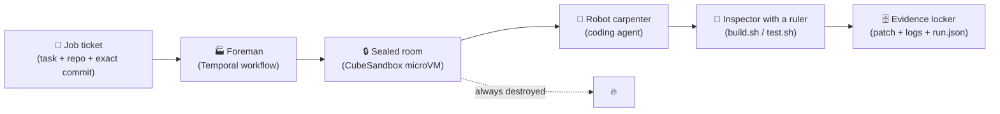

---

## 2. Why do you need a workshop at all? Why not just run the AI?

Picture three things going wrong when you just run a coding AI on your laptop:

1. **It lies, or at least it's overconfident.** It says "Done! All tests pass!" when they don't.
2. **It touches things it shouldn't.** Your SSH keys, your other repos, the internet.
3. **You forget what happened.** Next week someone asks "why did this change?" and you have nothing to show them.

ESF answers each problem with one component:

| Problem | ESF's answer | Analogy |
|---|---|---|
| The AI overclaims | Verification gates that only read exit codes | An inspector who ignores what the carpenter *says* and only trusts the ruler |
| The AI touches things | A fresh microVM for each run, destroyed afterwards | A sealed room that gets demolished after each job |
| Nobody remembers | An artifact store on the host | A logbook kept *outside* the room so it survives the demolition |
| The laptop crashes mid-job | Temporal durable workflows | A foreman with a clipboard who picks up where they left off after a power cut |

---

## 3. The most important idea: three separate verdicts

If you remember one thing from ESF, make it this:

```
agent_result        = SUCCESS
verification_result = FAILED
factory_result      = VERIFICATION_FAILED
```

The carpenter says "I did it!" The ruler says "no you didn't." **The factory believes the ruler.**

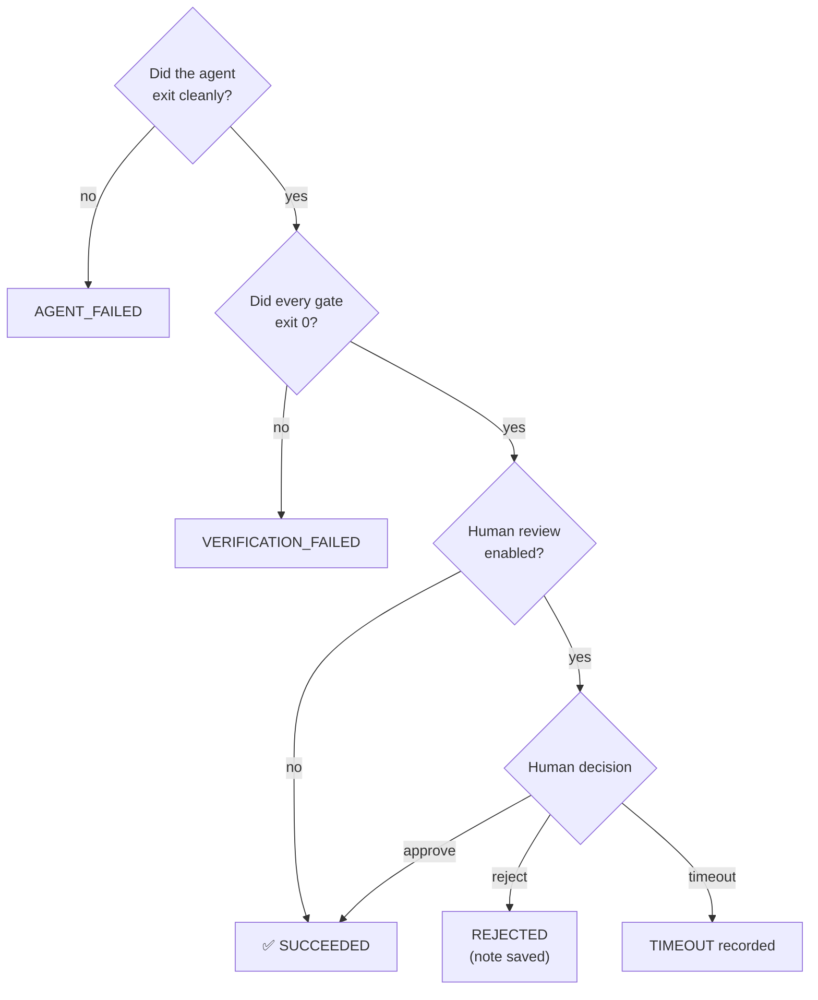

This is the best idea in the codebase. Many "AI dev" tools let the model mark its own homework. ESF doesn't.

---

## 4. Opening the box: the real architecture

### 4.1 Surprise: there are two machines in one box

ESF is a **fork of Machinist** (by Owain Lewis). The fork kept all of Machinist and bolted a new factory next to it. They share a Go module but hardly any code.

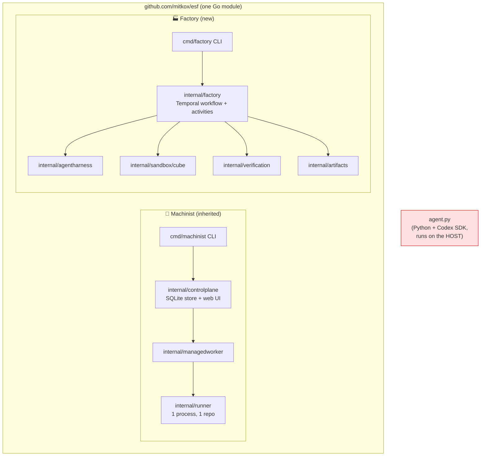

Think of a restaurant that bought the café next door and kept both kitchens running. Each kitchen works fine, but a customer has no idea which one to order from.

### 4.2 The factory's layers, from top to bottom

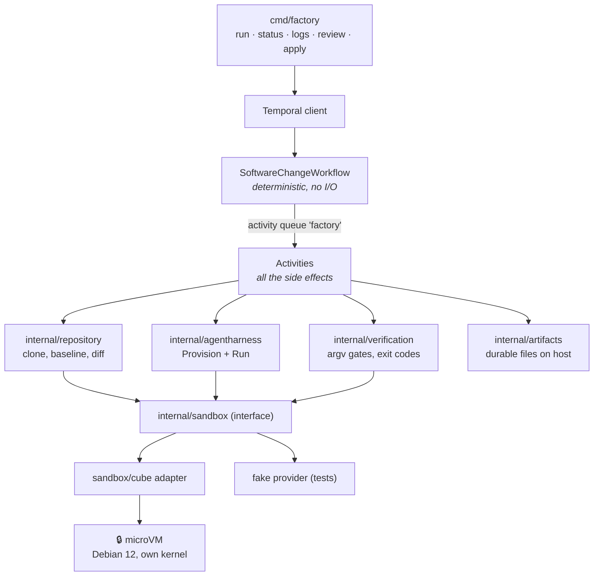

**The rule that holds it together:** the workflow is the *brain*, and it isn't allowed to touch anything. It only decides what to do next. Activities are the *hands*: they do all the network, file and process work.

Why? Temporal survives a crash by **replaying** the brain's decisions from its history. If the brain had read a file directly, the file could have changed by replay time, and the replay would take a different path. So the brain only decides, and the hands do the work and report back.

A nice consequence (in `resources.go`): named resources such as `[models]`, `[egress]`, `[budgets]` and `[scopes]` are resolved exactly **once**, in the validation activity, and frozen into the run. Edit the config mid-run and the run won't notice. That's deliberate.

### 4.3 One run, step by step

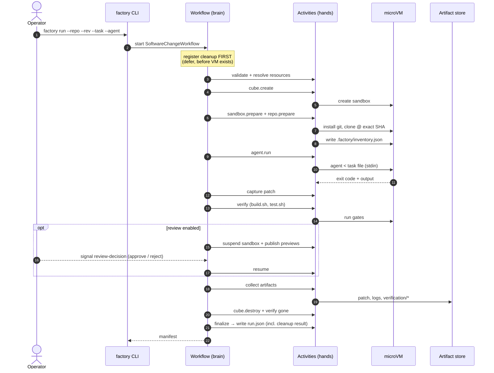

Look at step 3. **Cleanup is registered before the sandbox exists.** It's like arranging the demolition crew before you even build the room: whatever happens (crash, cancel, timeout), the room gets demolished. And `run.json` is written *after* the demolition is confirmed, so the logbook can truthfully say "the room is gone."

### 4.4 Who is trusted?

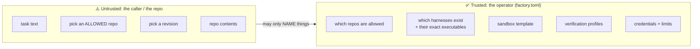

A caller can say "use the harness called `opencode2`." It can **never** say "run `/bin/sh -c ...`." The task text goes in as a file on stdin and never appears in a command line. It's like a restaurant where customers order from the menu and can't walk into the kitchen and pick up a knife.

### 4.5 Where things are kept

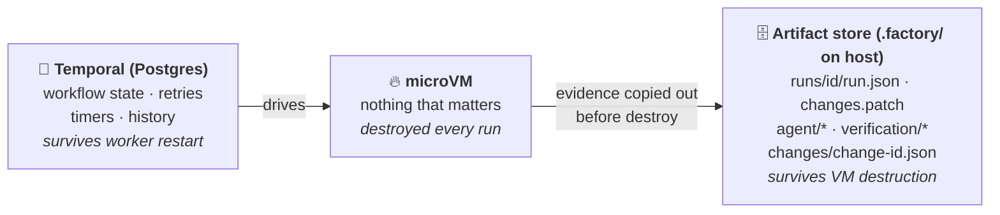

---

## 5. How does it handle agent memory? (The question you asked)

Here the Feynman method finds a gap. Let's try to explain it simply and see where the explanation breaks.

### 5.1 Three kinds of "memory"

When people say "agent memory" they usually mean one of three things:

| Kind | Human analogy | Does ESF have it? |
|---|---|---|
| **Working memory**: context inside one task | What you're holding in your head while you solve a problem | ✅ Yes, but only what the agent CLI keeps in its own context window, for one run |
| **Episodic memory**: "last time I tried this, it failed because…" | Remembering yesterday's mistake | ⚠️ **Written down, never read back** |
| **Semantic memory**: long-term facts, conventions, lessons | Knowing "in this house we take our shoes off" | ❌ No. `target-state.md` lists "RAG · long-term memory" as **explicit non-goals** |

### 5.2 What gets remembered, and by whom

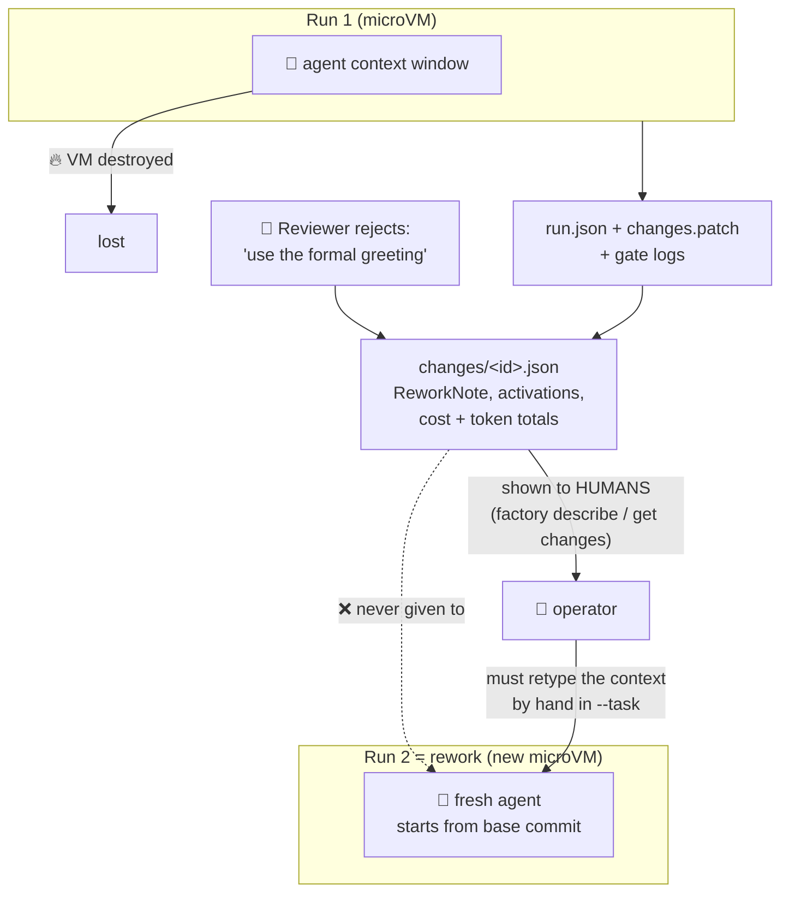

### 5.3 Checking the claim against the code

Feynman's rule: *don't fool yourself.* So here's what the code actually does.

- `factory run --change X --parent-run Y` still **requires** `--task` and `--rev` and builds a completely fresh `RunRequest` (`cmd/factory/main.go:187`).
- The reviewer's note is redacted and saved to the manifest (`activities.go:1005`) and copied to `Change.ReworkNote` (`change.go:338`). Nothing puts it into the new agent's prompt or `inventory.json`.
- **No code applies the parent run's patch.** There's no `git apply` anywhere. The rework agent starts from the original commit with a blank page.
- `--parent-run` is documented as *"run this one reworks (lineage evidence)"*. In other words, it only serves as a label.

### 5.4 The two things that *look* like memory but aren't

**Unreal harness session IDs** (`agentharness/unreal.go:177`): the session ID is `hash("session", runID)`. That sounds like memory, but it's really a *receipt number*. If a call is retried, the agent sees the same receipt and doesn't apply the task twice. That's protection against duplicates, not recall.

**`agent.py`** (the Python issue-to-PR script) keeps a `reviewed` set so each repair pass only sees *new* PR comments. That's real short-term episodic memory, but it lives in one Python process, disappears when the process exits, and is completely separate from the factory.

### 5.5 The one-line verdict

> **ESF has an excellent diary and a goldfish for a worker.**
> Everything is written down for *humans*, and nothing is handed back to the *agent*.

The docs knowingly separate "remembering a conversation" from "recovering a workflow" (`docs/coding-workflows-in-code.md:126`), and that separation is right. But the second half, feeding durable evidence back into the next attempt, was never built.

---

## 6. Critique: where the explanation got complicated

Feynman says: *if you can't explain it simply, something is off.* Here's where the simple explanation kept breaking down.

### 6.1 What's genuinely good 👍

| Strength | Why it matters |
|---|---|
| Three separate verdicts | The model never grades its own work |
| Callers name things and never execute them | Closes off a whole class of injection attacks |
| Task goes in via a stdin file, never argv | Untrusted text never becomes part of a shell command |
| Cleanup registered before the VM is created | No leaked microVMs, and it's actually tested |
| Resources resolved once and frozen | Config changes can't corrupt replay |
| SKIPPED is recorded with a reason | Evidence never claims a saving that didn't happen |
| ADRs list the rejected alternatives | Future maintainers can see *why*, not just *what* |

### 6.2 What's weak 👎

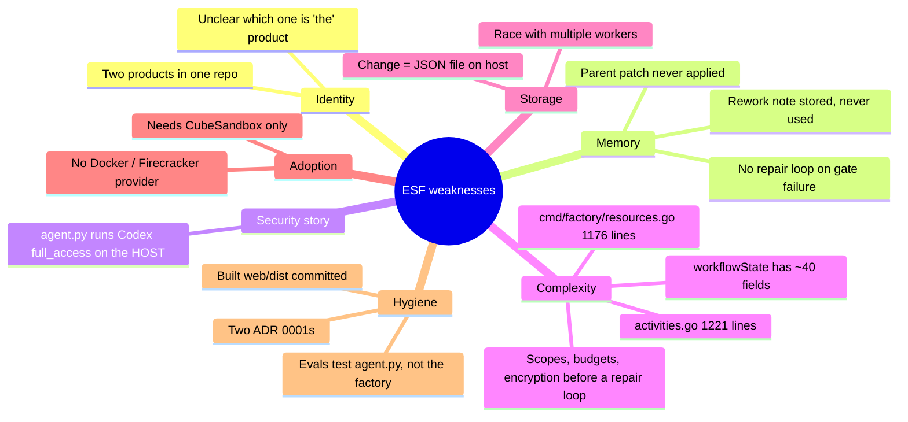

1. **Two products, one identity crisis.** Explain ESF to a friend and you'll soon be saying "…well, there's also the Machinist part, which has its own SQLite, workers and UI, but the factory doesn't use it." That's a sign they should be split, or one of them retired.

2. **The memory gap (section 5).** "Reject with a note" produces a note in a file and does nothing to improve the next attempt. This is the biggest *behavioural* gap.

3. **`agent.py` contradicts the rest of the project.** The project's main principle is isolation, and yet this script runs Codex with `Sandbox.full_access` in the current directory **on the host** (`agent.py:182`). It's like a bank vault with a side door propped open for convenience.

4. **Hardened before it's useful.** Tenancy scopes, budgets, payload encryption, preview URLs, suspend/resume: a lot of production machinery for a one-person, few-day-old codebase whose core loop can't retry after a failed test. Hardening is good, but the order is back to front.

5. **A god-object.** `workflowState` has about 40 fields covering every phase. Adding the next feature means touching a struct everything depends on.

6. **Changes stored as JSON files.** With two workers updating the same `changes/<id>.json`, the last writer wins. The single-writer assumption isn't documented.

7. **Hard dependency on CubeSandbox.** Almost nobody has CubeSandbox, and the fake provider is only for tests, so almost nobody can try it.

---

## 7. Constructive feedback: how to fix it, simply

### 7.1 Give the goldfish a notebook (the memory fix)

Keep ESF's philosophy (determinism, evidence, digests) and use it for memory too. **Memory should be a versioned file, not a database of vibes.**

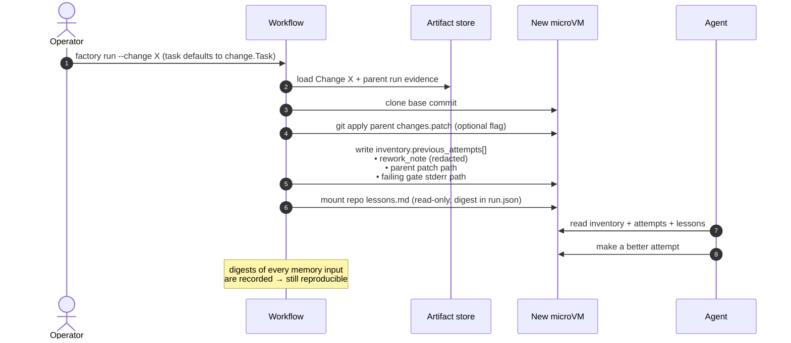

Priority order:

| # | Change | Effort | Why this order |
|---|---|---|---|
| 1 | On `--change`, add `previous_attempts[]` (redacted rework note, parent patch path, failing gate output) to `inventory.json`; `--task` defaults to `change.Task` | Small | Reuses the existing "inventory is the harness contract" design. No new infrastructure. |
| 2 | **Repair loop inside the workflow**: on `VERIFICATION_FAILED`, rerun the agent in the *same* sandbox with the gate stderr, up to N times | Small–medium | Temporal is made for this. The three-verdict model already supports it. |
| 3 | **Per-repo `lessons.md`**: operator-owned, mounted read-only, digest recorded | Small | Semantic memory without RAG, and still reproducible. |
| 4 | **`SessionResumer` capability**: the harness may resume a native session (Codex thread, `claude --resume`), recorded as SKIPPED if unsupported | Medium | Fits the existing `Suspender` / `Previewer` capability pattern. The durable patch stays the source of truth. |

### 7.2 The target loop

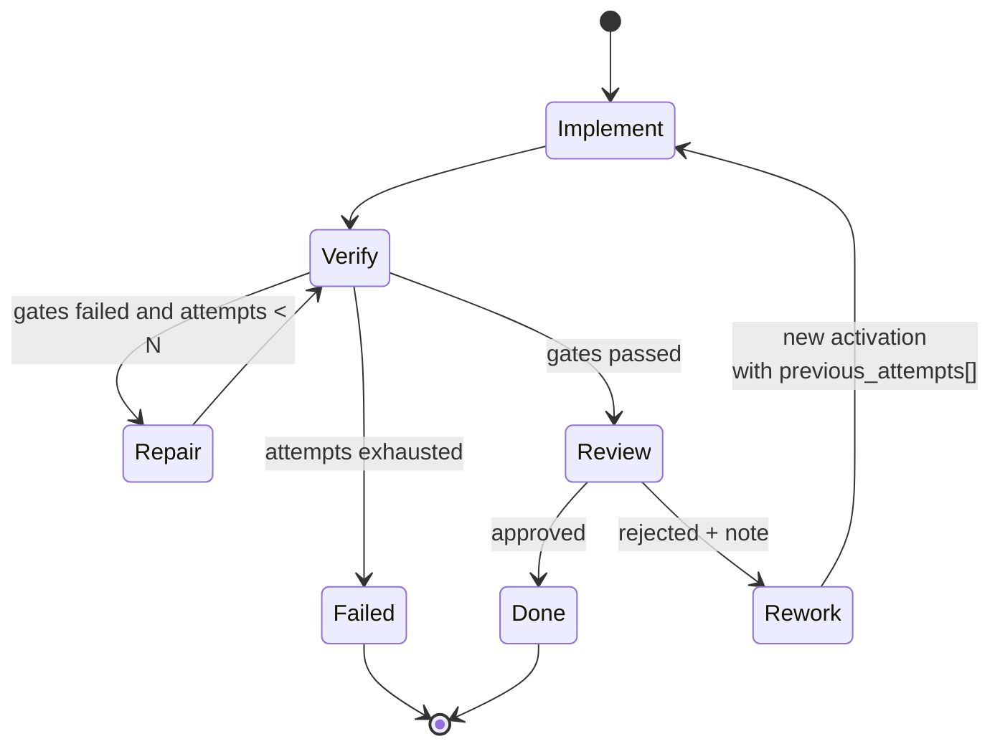

Right now ESF implements only the straight line `Implement → Verify → Review`. Every arrow that points *backwards* is missing, and those backward arrows are what memory is for.

### 7.3 Other fixes

| Area | Suggestion |
|---|---|
| Identity | Pick one product. Either move Machinist into its own module or make the factory use the Machinist control plane. |
| `agent.py` | Move it to `examples/` with a loud warning, or route it through `factory run` so it gets the sandbox too. |
| Complexity | Split `workflowState` into per-phase structs (`provisionState`, `agentState`, `verifyState`, `reviewState`). Move domain logic out of `cmd/factory/*.go`. |
| Storage | Let a Temporal workflow (one per Change) own the Change, or use SQLite/Postgres. Either fixes the multi-writer race. |
| Adoption | Add a `sandbox/docker` provider, clearly labelled *weaker isolation, dev only*. |
| Hygiene | Renumber the duplicate ADR 0001s, stop committing `web/dist`, and point the evals at the factory rather than `agent.py`. |

---

## 8. The Feynman test: can you explain ESF back?

If you can answer these without looking, you understand it:

1. **Why can't the workflow read a file directly?** *Temporal replays the workflow after a crash. A file read could return something different during replay, and the run would take a different path.*
2. **Why is cleanup registered before the VM exists?** *So every exit path, including a crash in the very next line, demolishes the room.*
3. **Why three verdicts instead of one?** *Because "the agent says it worked" and "it actually works" are different facts.*
4. **Where does agent memory live?** *For one run: in the agent's context window, which is destroyed with the VM. Across runs: in `changes/<id>.json`, which is read by humans only. Long-term: nowhere, by design.*
5. **What single change would help most?** *Feed the Change record (rework note, parent patch, failing gates) back into the next run's `inventory.json`.*

---

*Analysis based on `mitkox/esf` at commit `9c0c583` ("Productionize Unreal async harness integration"), cloned 2026-09-25.*
